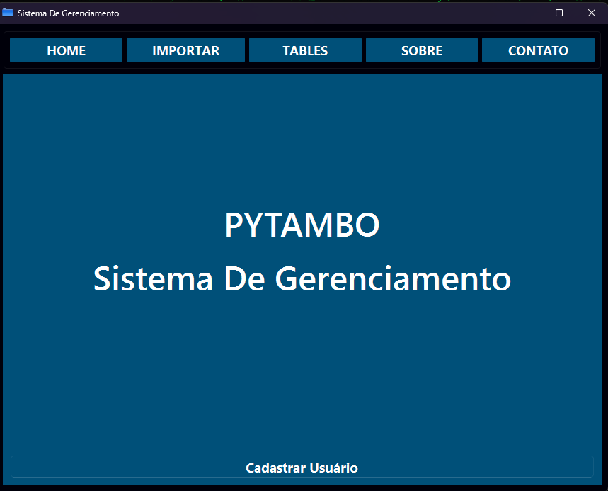

# 🧠 PYTAMBO — Sistema de Gerenciamento de Notas Fiscais

**PYTAMBO** é um sistema desktop desenvolvido em **Python com PySide6 (Qt)** para gerenciar notas fiscais eletrônicas (NF-e), com funcionalidades de importação, controle de estoque, geração de relatórios e gráficos.

---

## 🖼️ Tela Principal



---

## 🚀 Funcionalidades

- ✅ Login com controle de acesso (Administrador e Usuário)
- 📁 Importação de arquivos XML de NF-e (modelo 55)
- 📊 Controle de estoque com movimentações de saída e estorno
- 📤 Exportação para Excel
- 📈 Geração de gráficos interativos com Matplotlib
- 💾 Integração com SQLite
- 🎨 Interface amigável desenvolvida com PySide6

---

## 📦 Tecnologias utilizadas

- Python 3.x
- PySide6 (Qt for Python)
- SQLite3
- Pandas
- Matplotlib
- PyInstaller

---

## ⚙️ Como executar o projeto

### 1. Instale as dependências:
```bash
pip install -r requirements.txt
```

### 2. Rode o sistema:
```bash
python main.py
```

---

## 🗃️ Estrutura do Projeto

```
Projeto QT/
├── main.py                # Arquivo principal da aplicação
├── database.py            # Conexão e manipulação do banco SQLite
├── xml_files.py           # Processamento de arquivos XML de NF-e
├── ui_login.py            # Interface de login (gerada via Qt Designer)
├── ui_main.py             # Interface principal (gerada via Qt Designer)
├── icon.ico               # Ícone do sistema
├── system.db              # Banco de dados local
├── screenshot.png         # Imagem da interface principal
└── README.md              # Este arquivo
```

---

## 👤 Desenvolvedores

**Giovanni Tamborim** 
//
**Nicolas almeida-PyTax**  
🔗 [LinkedIn](https://www.linkedin.com/in/giovanni-tamborim-69001022a/)  
🐱 [GitHub](https://github.com/tamborim13)

---

## 📄 Licença

Este projeto é de uso livre para fins acadêmicos e educacionais.
